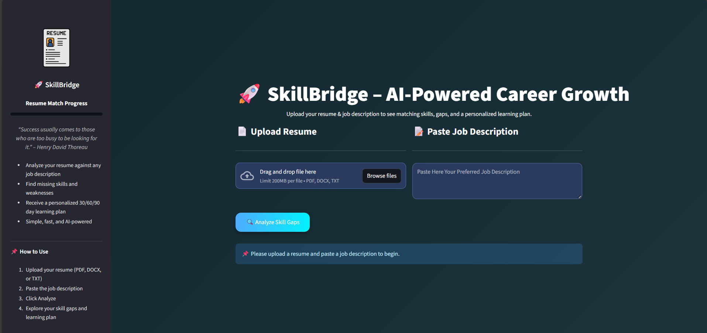

# 🚀 SkillBridge – AI-Powered Career Growth

SkillBridge is an AI-powered resume–job matching system that:
- Extracts skills from resumes and job descriptions
- Detects skill gaps & proficiency levels
- Suggests a **personalized 30/60/90-day learning plan**

The system is composed of:
- **Backend (FastAPI)** – Handles resume/job parsing, skill extraction, gap analysis  
- **Frontend (Streamlit)** – Interactive UI for users to upload resumes, paste job descriptions, and view results

---

## 📸 Project UI



---

## 📂 Project Structure

```
project-root/
│
├── backend/
│   ├── main.py                  # FastAPI backend
│   ├── skills/
│   │   └── unique_skills_dataset.csv
│
├── frontend/
│   ├── app.py                   # Streamlit frontend
│   ├── .streamlit/
│   │   └── config.toml
│
├── images/
│   └── resume.png
│
├── requirements.txt
└── README.md
```

---

## 🛠 Technologies Used

**Backend**
- FastAPI
- spaCy (NLP)
- Sentence Transformers (semantic similarity)
- pdfplumber, docx2txt (resume parsing)
- NumPy, regex

**Frontend**
- Streamlit (UI)
- Requests (API calls)
- Pandas
- PIL (image handling)

---

## ⚡ Installation & Running

### 1️⃣ Clone the repository
```bash
git clone https://github.com/your-username/skillbridge.git
cd skillbridge
```

### 2️⃣ Create and activate virtual environment
```bash
python -m venv venv
# On macOS/Linux
source venv/bin/activate
# On Windows
venv\Scripts\activate
```

### 3️⃣ Install dependencies
```bash
pip install -r requirements.txt
```

### 4️⃣ Run the Backend (FastAPI)
```bash
cd backend
python -m uvicorn main:app --reload
```
Backend will start at: [http://localhost:8000](http://localhost:8000)

### 5️⃣ Run the Frontend (Streamlit)
```bash
cd frontend
streamlit run app.py
```
Frontend will start at: [http://localhost:8501](http://localhost:8501)

### 6️⃣ Open in Browser
- Backend API Docs: [http://localhost:8000/docs](http://localhost:8000/docs)  
- Frontend App: [http://localhost:8501](http://localhost:8501)

---

## 🔑 API Endpoints

| Method | Endpoint         | Description                                         |
|--------|------------------|-----------------------------------------------------|
| POST   | `/parse/resume`  | Parse uploaded resume and extract skills             |
| POST   | `/parse/job`     | Extract skills from job description text             |
| POST   | `/analyze/gap`   | Compare resume & job skills, return gap analysis     |
| GET    | `/`              | Service health check                                |

---

## ✍️ Author
**Sarthak Maddi**  
💡 Developed with ❤️ for career growth automation.

---

## 🌟 Features
- **Skill Extraction** from PDF, DOCX, or text resumes  
- **Semantic Matching** using embeddings  
- **Skill Gap Analysis** with severity levels  
- **Learning Plan** generation (30/60/90 days)  
- **Modern UI** with animations & progress tracking  

---

## 📦 Example Usage
1. **Upload** your resume (`.pdf`, `.docx`, `.txt`) in the frontend UI.  
2. **Paste** your target job description.  
3. **Click** `Analyze`.  
4. **See:**
   - ✅ Skills found in resume  
   - ⚠ Missing / weak skills with severity  
   - 📅 Recommended learning plan  


